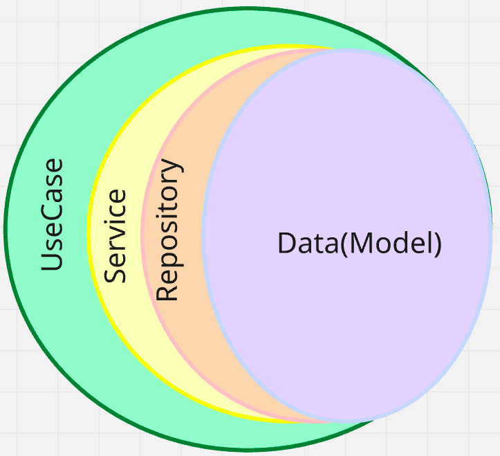

## Тестовое задание

Архитектурный подход:
- Использовалась чистая архитектура, разбитая на слои - на каждом слое свой DTO
- Использовался паттер Repository (Чтобы абстрагироваться от способа хранения)
- Использовались кастомные билдеры для моделей

Как развернуть?
 - Установить Taskfile
 - Запустить `task init`
